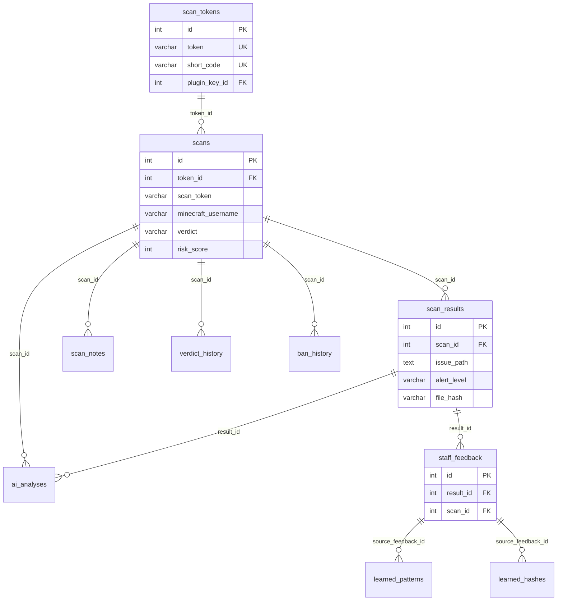
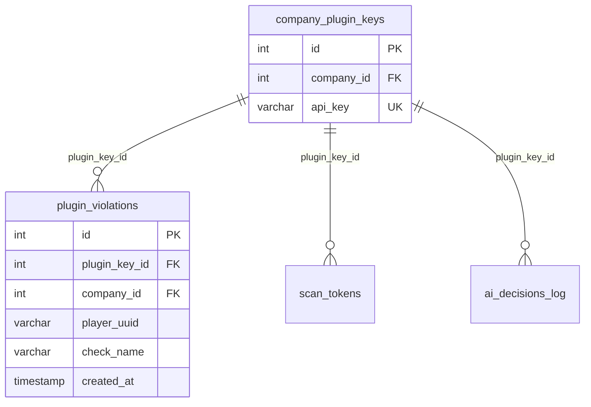
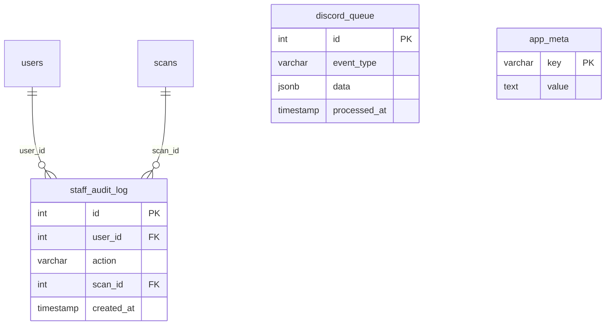

# Argus Projects — ER diagram visual completo (Pack 48-H Round 2)

> Fuente: inventario Round 1 (`schema-pack48.md`). FKs **explícitas** según `db_postgresql.py`; **implícitas** según convención de nombres (`*_id`) y uso en código.
> Cardinalidad Mermaid: `||` = exactamente uno, `o|` = cero o uno, `}o` = cero o muchos, `||--o{` = 1:N.

---

## Leyenda de sensibilidad de datos

| Tag | Significado | Ejemplos de columnas sensibles |
| --- | --- | --- |
| **PII** | Identifica o describe personas físicas / cuentas | `users.email`, `minecraft_username`, `ip_address`, `endpoint` (push) |
| **Transactional** | Estado operativo mutable, no derivado puro | `scans`, `scan_tokens`, `registration_tokens` |
| **Derived** | Computado o agregado desde otras fuentes | `ai_player_scores`, `learned_patterns`, `statistics` |
| **Ephemeral** | Cola / cache / TTL corto | `discord_queue` (processed), tokens expirados |
| **Audit** | Append-only forense | `staff_audit_log`, `verdict_history`, `ai_decisions_log` |
| **Config** | Parámetros de producto | `company_settings`, `ai_weights`, `configurations` |

### Matriz por tabla (43)

| Tabla | Dominio | Sensibilidad |
| --- | --- | --- |
| companies | Companies/Tenants | PII (contact_email, contact_phone) + Config |
| users | Auth/Users | PII |
| registration_tokens | Auth/Users | PII (token) + Transactional |
| company_settings | Companies/Tenants | Config |
| download_links | Auth/Users | Transactional |
| push_subscriptions | Auth/Users | PII (endpoint keys) |
| app_settings | Cache/Tmp | Config (secrets VAPID) |
| scan_tokens | Scans | Transactional + PII (created_by string) |
| scans | Scans | PII + Transactional |
| scan_results | Scans | Derived (detections) |
| ai_analyses | Scans | Derived |
| scan_notes | Scans | PII (author text) |
| verdict_history | Audit/Logs | Audit |
| ban_history | Scans | PII + Audit |
| staff_feedback | Scans | PII + Audit |
| evidence_fingerprints | Scans | Derived |
| learned_patterns | AI/Oracle | Derived |
| learned_hashes | AI/Oracle | Derived |
| learned_hack_patterns | AI/Oracle | Derived |
| hack_hashes | Scans | Config/Reference |
| hack_blacklist | Scans | Reference |
| mod_whitelist | Scans | Config/Reference |
| type_confidence_thresholds | AI/Oracle | Config |
| auto_labels | AI/Oracle | Derived |
| ai_model_versions | AI/Oracle | Config |
| staff_trust | Auth/Users | Derived |
| company_fp_cooldown | Companies/Tenants | Derived |
| company_plugin_keys | Plugin/MC | PII (api_key) + Transactional |
| plugin_violations | Plugin/MC | PII (player_uuid, player_name) + Audit |
| ai_player_scores | AI/Oracle | PII + Derived |
| ai_decisions_log | AI/Oracle | PII + Audit |
| ai_weights | AI/Oracle | Config |
| ai_feedback | AI/Oracle | PII + Audit |
| ai_auto_labels | AI/Oracle | Derived |
| ai_model_state | AI/Oracle | Derived (blobs JSON) |
| ai_player_profiles | AI/Oracle | PII + Derived |
| ai_training_history | AI/Oracle | Audit + Derived |
| app_meta | Audit/Logs | Config/Ephemeral |
| app_versions | Cache/Tmp | Config |
| configurations | Cache/Tmp | Config |
| statistics | Cache/Tmp | Derived |
| staff_audit_log | Audit/Logs | PII + Audit |
| discord_queue | Audit/Logs | Ephemeral + PII (JSON payload) |

---

## Diagrama 1 — Auth / Users

```mermaid
erDiagram
    companies ||--o{ users : "company_id"
    companies ||--o{ registration_tokens : "company_id"
    users ||--o{ registration_tokens : "created_by"
    users ||--o{ registration_tokens : "used_by"
    users ||--o{ push_subscriptions : "user_id"
    users ||--|| staff_trust : "user_id PK"

    companies {
        int id PK
        varchar name UK
        varchar contact_email
        bool is_active
    }
    users {
        int id PK
        varchar username UK
        varchar email UK
        text password_hash
        text roles
        int company_id FK
        bool is_active
    }
    registration_tokens {
        int id PK
        varchar token UK
        int company_id FK
        int created_by FK
        int used_by FK
        bool is_used
    }
    push_subscriptions {
        int id PK
        text endpoint UK
        text p256dh
        text auth
        int user_id FK
    }
    staff_trust {
        int user_id PK FK
        real trust_score
    }
```

---

## Diagrama 2 — Companies / Tenants

```mermaid
erDiagram
    companies ||--|| company_settings : "company_id PK"
    companies ||--|| company_fp_cooldown : "company_id PK"
    companies ||--o{ company_plugin_keys : "company_id"
    companies ||--o{ plugin_violations : "company_id"
    companies ||--o{ ai_player_scores : "company_id"
    companies ||--o{ ai_decisions_log : "company_id"
    companies ||--o{ ai_feedback : "company_id"
    companies ||--o{ ai_auto_labels : "company_id"
    companies ||--o{ ai_player_profiles : "company_id"
    companies ||--o{ ai_training_history : "company_id"
    companies ||--o{ ai_model_state : "company_id"
    companies ||--o{ ai_weights : "company_id UK"

    company_settings {
        int company_id PK FK
        varchar mode
        int threshold_critical
    }
    company_fp_cooldown {
        int company_id PK FK
        int fp_count_24h
        int threshold_bump
    }
    company_plugin_keys {
        int id PK
        int company_id FK
        varchar api_key UK
    }
```

> **Implícito:** todas las FKs `company_id` → `companies.id` salvo que el DDL no declare `REFERENCES` (app.py / plugin schema).

---

## Diagrama 3 — Scans (core)



> **Implícito:** `scan_tokens.plugin_key_id` → `company_plugin_keys.id`.  
> **Gap conocido (F-001):** `scans.company_id` usado en código pero **no** en DDL — no aparece en este diagrama hasta migración.

---

## Diagrama 4 — AI / Oracle

```mermaid
erDiagram
    ai_weights {
        int id PK
        int company_id UK
        text weights_json
    }
    ai_player_scores {
        int id PK
        int company_id FK
        varchar player_uuid
        real score
    }
    ai_decisions_log {
        int id PK
        int company_id FK
        int plugin_key_id FK
        varchar player_uuid
    }
    ai_feedback {
        int id PK
        int company_id FK
        int decision_id FK
    }
    ai_auto_labels {
        int id PK
        int company_id FK
        int decision_id FK
    }
    ai_model_state {
        int id PK
        int company_id FK
        varchar model_kind
    }
    ai_player_profiles {
        int id PK
        int company_id FK
        varchar player_uuid
    }
    ai_training_history {
        int id PK
        int company_id FK
        varchar model_kind
    }
    auto_labels {
        int id PK
        int scan_id UK FK
    }

    ai_decisions_log ||--o{ ai_feedback : "decision_id"
    ai_decisions_log ||--o{ ai_auto_labels : "decision_id"
    scans ||--o| auto_labels : "scan_id"
```

> **Nota:** `auto_labels` (ml_classifier) ≠ `ai_auto_labels` (Pack 45).

---

## Diagrama 5 — Plugin / Minecraft



---

## Diagrama 6 — Audit / Logs + colas



---

## Diagrama 7 — Reference / cache / misc

```mermaid
erDiagram
    hack_hashes {
        int id PK
        varchar sha256 UK
    }
    hack_blacklist {
        varchar sha256 PK
    }
    mod_whitelist {
        int id PK
        varchar sha256 UK
    }
    type_confidence_thresholds {
        int id PK
        varchar issue_type UK
    }
    learned_hack_patterns {
        int id PK
        varchar pattern_kind
        varchar pattern_value
    }
    evidence_fingerprints {
        text fingerprint PK
        int sample_scan_id FK
    }
    app_versions {
        int id PK
        varchar version UK
    }
    configurations {
        int id PK
        varchar key UK
    }
    statistics {
        int id PK
        date date
    }
    ai_model_versions {
        int id PK
        varchar version UK
    }
    app_settings {
        text key PK
        text value
    }
    download_links {
        int id PK
        varchar token UK
    }
```



---

## Relaciones implícitas (no en DDL) — checklist

| Desde | Hacia | Columna | Severidad si falta FK |
| --- | --- | --- | --- |
| plugin_violations | companies | company_id | MED (integridad referencial) |
| plugin_violations | company_plugin_keys | plugin_key_id | MED |
| ai_decisions_log | companies | company_id | MED |
| ai_feedback | ai_decisions_log | decision_id | LOW (nullable) |
| evidence_fingerprints | scans | sample_scan_id | LOW |
| push_subscriptions | users | user_id | LOW |
| company_settings | companies | company_id | implicit PK=FK |

---

## Cómo leer los diagramas en GitHub / VS Code

- GitHub renderiza Mermaid en `.md` nativamente.
- VS Code: extensión "Markdown Preview Mermaid Support".

Si el render falla por tamaño, abrir cada bloque ` ```mermaid ` por separado.
