# Argus Projects — Esquema de base de datos · Pack 48

> Auditor: subagente H del sprint Pack 48 (Argus Projects).
> Commit base: `d263634` (post 720-backlog).
> Origen: extracción de los `CREATE TABLE IF NOT EXISTS` / `CREATE INDEX` / `ALTER TABLE` embebidos en el código Python.
> Esta documentación **no** existía antes (no había un esquema único en archivos `.sql`).

Toda la app vive en un único PostgreSQL gestionado en Render (producción) o en SQLite (`auth.db` + `scanner_db.sqlite`) para desarrollo local. La selección se hace en runtime via `_USE_PG` y un placeholder `_PH` (`%s` para PG/MySQL, `?` para SQLite).

Las tablas se crean **de forma perezosa** desde varias funciones distintas:

| Módulo / función | Tablas que materializa |
| --- | --- |
| `web_app/db_postgresql.py:init_postgresql_db()` | base "histórica" (scan_tokens, scans, scan_results, ban_history, ai_analyses, companies, users, download_links, registration_tokens, app_versions, configurations, statistics, staff_feedback, learned_patterns, learned_hashes, ai_model_versions, scan_notes, verdict_history, hack_hashes, mod_whitelist, type_confidence_thresholds, discord_queue) |
| `web_app/auth.py:init_auth_db()` | mirror SQLite de auth + scanner |
| `web_app/app.py:init_db_async()` | `app_meta`, `download_links` (PG migration), `hack_blacklist`, columnas opcionales en `scan_tokens`/`scans` |
| `web_app/app.py:_ensure_plugin_keys_schema()` | `company_plugin_keys`, `plugin_violations`, `ai_player_scores`, `ai_decisions_log`, `ai_weights`, `ai_feedback`, `ai_auto_labels`, `ai_model_state`, `ai_player_profiles`, `ai_training_history` |
| `web_app/app.py:_ensure_evidence_fingerprints_table()` | `evidence_fingerprints` |
| `web_app/app.py:_log_staff_action()` (lazy) | `staff_audit_log` |
| `web_app/app.py:_get_company_settings()` / `set_company_settings_endpoint()` (lazy) | `company_settings` |
| `web_app/app.py:push_subscribe()` (lazy) | `push_subscriptions` |
| `web_app/app.py:_get_vapid_keys()` (lazy) | `app_settings` |
| `web_app/ai_trust.py:ensure_trust_tables()` | `staff_trust`, `company_fp_cooldown` |
| `web_app/ai_autolearn.py:ensure_autolearn_table()` | `learned_hack_patterns` |
| `web_app/ml_classifier.py:_ensure_auto_labels_table()` | `auto_labels` |

> ⚠️ El nombre de tabla **`auto_labels`** (ml_classifier) **no es** el mismo que **`ai_auto_labels`** (plugin schema). Documentar el conflicto/duplicación para evitar confusión — están descritas en su propia sección.

---

## Índice de tablas (34 en total)

### Auth / multi-tenant
1. `companies`
2. `users`
3. `registration_tokens`
4. `company_settings`
5. `download_links`
6. `push_subscriptions`
7. `app_settings`

### Scan core
8. `scan_tokens`
9. `scans`
10. `scan_results`
11. `ai_analyses`
12. `scan_notes`
13. `verdict_history`
14. `ban_history`
15. `staff_feedback`
16. `evidence_fingerprints`

### Aprendizaje / clasificador
17. `learned_patterns`
18. `learned_hashes`
19. `learned_hack_patterns` (Pack 36)
20. `hack_hashes`
21. `hack_blacklist`
22. `mod_whitelist`
23. `type_confidence_thresholds`
24. `auto_labels` (ml_classifier)
25. `ai_model_versions`

### Pack 32 — Trust + cooldown
26. `staff_trust`
27. `company_fp_cooldown`

### Pack 43 — Plugin / anti-cheat
28. `company_plugin_keys`
29. `plugin_violations`

### Pack 44 — Oracle AI
30. `ai_player_scores`
31. `ai_decisions_log`
32. `ai_weights`

### Pack 45 — ML híbrido
33. `ai_feedback`
34. `ai_auto_labels`
35. `ai_model_state`
36. `ai_player_profiles`
37. `ai_training_history`

### Sistema / observabilidad
38. `app_meta`
39. `app_versions`
40. `configurations`
41. `statistics`
42. `staff_audit_log`
43. `discord_queue`

(43 tablas en total — el resumen original de "34" sub-cuenta cuando se dejan fuera `app_meta`, `app_versions`, `configurations`, `statistics`, `staff_audit_log`, `discord_queue`, `ai_model_versions`, `auto_labels` y `app_settings`).

---

## Diagrama de FKs (high-level)

```mermaid
erDiagram
    companies ||--o{ users : "has"
    companies ||--o{ registration_tokens : "issues"
    companies ||--o{ company_plugin_keys : "owns"
    companies ||--o{ plugin_violations : "logs"
    companies ||--o{ ai_player_scores : "ranks"
    companies ||--o{ ai_decisions_log : "decisions"
    companies ||--o{ ai_feedback : "feedback"
    companies ||--o{ ai_auto_labels : "labels"
    companies ||--o{ ai_player_profiles : "profiles"
    companies ||--o{ ai_training_history : "trainings"
    companies ||--o{ ai_model_state : "models"
    companies ||--o{ ai_weights : "weights"
    companies ||--|| company_settings : "1:1"
    companies ||--|| company_fp_cooldown : "1:1"

    users ||--o{ staff_audit_log : "actions"
    users ||--|| staff_trust : "1:1"
    users ||--o{ registration_tokens : "creates"
    users ||--o{ push_subscriptions : "owns"

    scan_tokens ||--o{ scans : "spawns"
    scan_tokens }o--|| company_plugin_keys : "plugin_key_id"
    scans ||--o{ scan_results : "produces"
    scans ||--o{ scan_notes : "annotated"
    scans ||--o{ verdict_history : "verdicts"
    scans ||--o{ ban_history : "bans"
    scans ||--o{ ai_analyses : "analyses"
    scan_results ||--o{ ai_analyses : "details"
    scan_results ||--o{ staff_feedback : "reviewed"

    ai_player_scores ||--o{ ai_decisions_log : "history"
    ai_decisions_log ||--o{ ai_feedback : "reviewed"
    ai_decisions_log ||--o{ ai_auto_labels : "labeled"
```



> ⚠️ Muchas relaciones del diagrama son **implícitas** (existe la columna pero **no** hay `FOREIGN KEY` declarada). Detallado en cada tabla y en `findings-pack48.md`.

---

# Definición de tablas

> Convenciones de las columnas: tipo PG (los renombres a SQLite son automáticos vía `_PH` y `SERIAL→INTEGER PRIMARY KEY AUTOINCREMENT`). Marca `?` = nullable, `→` = FK declarada, `↣` = FK implícita.

## 1. `companies`

Creada en `db_postgresql.py:226` y mirror SQLite en `auth.py:107`. Tenant raíz.

| col | tipo | default | nullable | refs |
| --- | --- | --- | --- | --- |
| id | SERIAL PK | — | NO | — |
| name | VARCHAR(255) UNIQUE | — | NO | — |
| contact_email | VARCHAR(255) | — | YES | — |
| contact_phone | VARCHAR(50) | — | YES | — |
| subscription_type | VARCHAR(50) | `'enterprise'` | YES | — |
| subscription_status | VARCHAR(50) | `'active'` | YES | — |
| subscription_start_date | TIMESTAMP | `CURRENT_TIMESTAMP` | YES | — |
| subscription_end_date | TIMESTAMP | — | YES | — |
| subscription_price | DECIMAL(10,2) | `13.0` | YES | — |
| max_users | INTEGER | `8` | YES | — |
| max_admins | INTEGER | `3` | YES | — |
| created_at | TIMESTAMP | `CURRENT_TIMESTAMP` | YES | — |
| created_by | INTEGER | — | YES | ↣ users.id (definida sólo en SQLite mirror) |
| is_active | BOOLEAN | `TRUE` | YES | — |
| notes | TEXT | — | YES | — |

**Índices:** `idx_name`, `idx_active`.
**Pack:** existe desde antes del Pack 32 — la cuenta default `arefy` se inserta al boot.

## 2. `users`

Creada en `db_postgresql.py:262` y mirror SQLite en `auth.py:149`. Soporta `roles` como JSON array.

| col | tipo | default | nullable | refs |
| --- | --- | --- | --- | --- |
| id | SERIAL PK | — | NO | — |
| username | VARCHAR(255) UNIQUE | — | NO | — |
| email | VARCHAR(255) UNIQUE | — | YES | — |
| password_hash | VARCHAR(255) | — | NO | — |
| roles | TEXT | `'["user"]'` | YES | JSON array de strings |
| company_id | INTEGER | — | YES | → companies.id ON DELETE SET NULL |
| is_active | BOOLEAN | `TRUE` | YES | — |
| created_at | TIMESTAMP | `CURRENT_TIMESTAMP` | YES | — |
| last_login | TIMESTAMP | — | YES | — |
| created_by | VARCHAR(255) | — | YES | (legacy: a veces es int, a veces string) |
| avatar_url | TEXT | — | YES | añadida vía ALTER TABLE |

**Índices:** `idx_username`, `idx_email`, `idx_company_id`.

## 3. `registration_tokens`

Creada en `db_postgresql.py:302`.

| col | tipo | default | nullable | refs |
| --- | --- | --- | --- | --- |
| id | SERIAL PK | — | NO | — |
| token | VARCHAR(255) UNIQUE | — | NO | — |
| company_id | INTEGER | — | YES | → companies.id ON DELETE SET NULL |
| created_by | INTEGER | — | NO | → users.id ON DELETE CASCADE |
| created_at | TIMESTAMP | `CURRENT_TIMESTAMP` | YES | — |
| expires_at | TIMESTAMP | — | YES | — |
| used_at | TIMESTAMP | — | YES | — |
| is_used | BOOLEAN | `FALSE` | YES | — |
| used_by | INTEGER | — | YES | → users.id ON DELETE SET NULL |
| max_uses | INTEGER | `1` | YES | — |
| description | TEXT | — | YES | — |
| is_admin_token | BOOLEAN | `FALSE` | YES | — |

**Índices:** `idx_token`, `idx_company_id`.

## 4. `company_settings`

Creada **lazy** en `app.py:6270`, `app.py:6361` y `app.py:13722` (DDL repetido 3× idéntico — ver `findings`). Es 1-to-1 con `companies`.

| col | tipo | default | nullable | refs |
| --- | --- | --- | --- | --- |
| company_id | INTEGER PRIMARY KEY | — | NO | ↣ companies.id (sin FK formal) |
| mode | VARCHAR(20) | `'normal'` | YES | tournament \| normal \| casual |
| threshold_critical | INTEGER | `70` | YES | — |
| threshold_suspicious | INTEGER | `30` | YES | — |
| updated_at | TIMESTAMP | `NOW()` | YES | — |
| updated_by | INTEGER | — | YES | ↣ users.id |

**Índices:** ninguno (PK ya basta).
**Pack:** Pack 32 (F#54 contexto de modo tournament/casual).

## 5. `download_links`

Versión SQLite (`auth.py:185`) usa `created_by INTEGER` con FK; versión PG (`db_postgresql.py:283` + `init_db_async`) usa `VARCHAR(100)`. Hay una migración explícita PG que dropea FK y cambia el tipo (`db_postgresql.py:468`).

| col | tipo | default | nullable | refs |
| --- | --- | --- | --- | --- |
| id | SERIAL PK | — | NO | — |
| token | VARCHAR(255) UNIQUE | — | NO | — |
| filename | VARCHAR(255) | — | NO | — |
| created_by | VARCHAR(100) | — | YES | (legacy FK eliminado en PG) |
| created_at | TIMESTAMP | `CURRENT_TIMESTAMP` | YES | — |
| expires_at | TIMESTAMP | — | YES | — |
| max_downloads | INTEGER | `1` | YES | — |
| download_count | INTEGER | `0` | YES | — |
| is_active | BOOLEAN | `TRUE` | YES | — |
| description | TEXT | — | YES | — |

**Índices:** `idx_dl_token`, `idx_download_links_token`, `idx_download_links_active`, `idx_token`, `idx_active`.
**Nota:** hay índices con nombre duplicado (`idx_token` también está en `scan_tokens` y `registration_tokens`); en PG cada índice tiene scope global, ver `findings`.

## 6. `push_subscriptions`

Creada **lazy** en `app.py:5679` la primera vez que un browser se suscribe.

| col | tipo | default | nullable | refs |
| --- | --- | --- | --- | --- |
| id | SERIAL PK | — | NO | — |
| endpoint | TEXT UNIQUE | — | NO | — |
| p256dh | TEXT | — | NO | — |
| auth | TEXT | — | NO | — |
| user_id | INTEGER | — | YES | ↣ users.id |
| created_at | TIMESTAMP | `NOW()` | YES | — |

**Índices:** UNIQUE en `endpoint` (PK auto).
**Pack:** Web Push (Pack 38-39 aprox).

## 7. `app_settings`

Singleton key-value (creada en `app.py:5597`). Hoy sólo guarda VAPID keys.

| col | tipo | default | nullable |
| --- | --- | --- | --- |
| key | TEXT PRIMARY KEY | — | NO |
| value | TEXT | — | YES |

## 8. `scan_tokens`

Base creada en `db_postgresql.py:101`. Tiene **6 columnas añadidas vía ALTER** a lo largo de los Packs (ver `schema-evolution.md`):

| col | tipo | default | nullable | refs / pack |
| --- | --- | --- | --- | --- |
| id | SERIAL PK | — | NO | — |
| token | VARCHAR(255) UNIQUE | — | NO | — |
| created_at | TIMESTAMP | `CURRENT_TIMESTAMP` | YES | — |
| expires_at | TIMESTAMP | — | YES | — |
| used_count | INTEGER | `0` | YES | — |
| max_uses | INTEGER | `-1` | YES | -1 = ilimitado |
| is_active | BOOLEAN | `TRUE` | YES | — |
| created_by | VARCHAR(255) | — | YES | — |
| description | TEXT | — | YES | — |
| allowed_mods | TEXT | NULL | YES | P2 #2 — JSON array de SHA256 |
| short_code | VARCHAR(8) UNIQUE | — | YES | Pack ~40 — código 6-char |
| plugin_key_id | INTEGER | — | YES | ↣ company_plugin_keys.id (Pack 43) |
| minecraft_staff | VARCHAR(160) | — | YES | Pack 43 |
| minecraft_target | VARCHAR(160) | — | YES | Pack 43 |
| source | VARCHAR(32) | `'web'` | YES | Pack 43 — web \| plugin |

**Índices:** `idx_token`, `idx_active(is_active, expires_at)`, `idx_st_short_code`, `idx_scan_tokens_active`.

## 9. `scans`

Base creada en `db_postgresql.py:124`. Tabla central. Recibe **8+ columnas via ALTER** (verdict, risk_score, screenshot, mc_info, os…).

| col | tipo | default | nullable | refs |
| --- | --- | --- | --- | --- |
| id | SERIAL PK | — | NO | — |
| token_id | INTEGER | — | YES | → scan_tokens.id ON DELETE SET NULL |
| scan_token | VARCHAR(255) | — | YES | (legacy, redundante con `token_id`) |
| started_at | TIMESTAMP | `CURRENT_TIMESTAMP` | YES | — |
| completed_at | TIMESTAMP | — | YES | — |
| status | VARCHAR(50) | `'running'` | YES | running \| completed \| error |
| total_files_scanned | INTEGER | `0` | YES | — |
| total_dirs_scanned | INTEGER | `0` | YES | añadida vía ALTER |
| issues_found | INTEGER | `0` | YES | — |
| scan_duration | DECIMAL(10,2) | — | YES | segundos |
| machine_id | VARCHAR(255) | — | YES | — |
| machine_name | VARCHAR(255) | — | YES | — |
| ip_address | VARCHAR(45) | — | YES | — |
| country | VARCHAR(100) | — | YES | — |
| minecraft_username | VARCHAR(255) | — | YES | — |
| ensemble_data | TEXT | — | YES | JSON del veredicto 6-sistemas |
| verdict | VARCHAR(20) | — | YES | clean \| hack \| pending |
| verdict_reason | TEXT | — | YES | — |
| verdict_by | VARCHAR(100) | — | YES | — |
| verdict_at | TIMESTAMP | — | YES | — |
| screenshot | TEXT | — | YES | base64 o URL |
| mc_info | TEXT | — | YES | JSON Minecraft contextual |
| risk_score | INTEGER | `0` | YES | 0..100 |
| os | VARCHAR(32) | `'Windows'` | YES | — |

**Índices:** `idx_token_id`, `idx_scan_token`, `idx_status`, `idx_started_at`.
**🟥 GAP detectado:** el código en `app.py:15733-15765` ejecuta `SELECT ... FROM scans WHERE company_id = ...` pero **no existe ninguna `ALTER TABLE scans ADD COLUMN company_id`** en el repo. Esto es un bug grave de aislamiento Pack 42 — ver `findings-pack48.md` (SEV-HIGH).

## 10. `scan_results`

Creada en `db_postgresql.py:182`. Datos por hallazgo dentro de un scan.

| col | tipo | default | nullable | refs |
| --- | --- | --- | --- | --- |
| id | SERIAL PK | — | NO | — |
| scan_id | INTEGER | — | YES | → scans.id ON DELETE CASCADE |
| issue_type | TEXT | — | YES | (originalmente VARCHAR(255); ampliado a TEXT) |
| issue_name | TEXT | — | YES | idem |
| issue_path | TEXT | — | YES | — |
| issue_category | TEXT | — | YES | (idem) |
| alert_level | VARCHAR(50) | — | YES | LIMPIO \| POCO_SOSPECHOSO \| SOSPECHOSO \| CRITICAL |
| confidence | DECIMAL(5,2) | — | YES | 0..1 |
| detected_patterns | TEXT | — | YES | JSON |
| obfuscation_detected | BOOLEAN | `FALSE` | YES | — |
| file_hash | VARCHAR(64) | — | YES | SHA256 |
| ai_analysis | TEXT | — | YES | — |
| ai_confidence | DECIMAL(5,2) | — | YES | — |
| created_at | TIMESTAMP | `CURRENT_TIMESTAMP` | YES | — |
| feedback_status | VARCHAR(20) | NULL | YES | añadida vía ALTER (PG: line 156) |
| extra | TEXT | NULL | YES | añadida vía ALTER — metadata libre |

**Índices:** `idx_scan_id`, `idx_issue_type`, `idx_alert_level`, `idx_results_scan`, `idx_results_level`.

## 11. `ai_analyses`

Creada en `db_postgresql.py:207`.

| col | tipo | default | nullable | refs |
| --- | --- | --- | --- | --- |
| id | SERIAL PK | — | NO | — |
| scan_id | INTEGER | — | YES | → scans.id ON DELETE CASCADE |
| result_id | INTEGER | — | YES | → scan_results.id ON DELETE CASCADE |
| analysis_type | VARCHAR(255) | — | YES | — |
| ai_model | VARCHAR(255) | — | YES | — |
| analysis_result | TEXT | — | YES | — |
| confidence | DECIMAL(5,2) | — | YES | — |
| created_at | TIMESTAMP | `CURRENT_TIMESTAMP` | YES | — |

**Índices:** `idx_scan_id`, `idx_result_id`.

## 12. `scan_notes`

Creada en `db_postgresql.py:482`.

| col | tipo | default | nullable | refs |
| --- | --- | --- | --- | --- |
| id | SERIAL PK | — | NO | — |
| scan_id | INTEGER | — | NO | → scans.id ON DELETE CASCADE |
| author | VARCHAR(100) | — | NO | — |
| body | TEXT | — | NO | — |
| created_at | TIMESTAMP | `CURRENT_TIMESTAMP` | YES | — |

**Índices:** `idx_scan_notes_scan_id`.

## 13. `verdict_history`

Creada en `db_postgresql.py:494`.

| col | tipo | default | nullable | refs |
| --- | --- | --- | --- | --- |
| id | SERIAL PK | — | NO | — |
| scan_id | INTEGER | — | NO | → scans.id ON DELETE CASCADE |
| verdict | VARCHAR(20) | — | NO | — |
| reason | TEXT | — | YES | — |
| changed_by | VARCHAR(100) | — | NO | — |
| changed_at | TIMESTAMP | `CURRENT_TIMESTAMP` | YES | — |

**Índices:** `idx_vh_scan_id`.

## 14. `ban_history`

Creada en `db_postgresql.py:163`.

| col | tipo | default | nullable | refs |
| --- | --- | --- | --- | --- |
| id | SERIAL PK | — | NO | — |
| machine_id | VARCHAR(255) | — | YES | — |
| minecraft_username | VARCHAR(255) | — | YES | — |
| ip_address | VARCHAR(45) | — | YES | — |
| ban_reason | TEXT | — | YES | — |
| hack_type | VARCHAR(255) | — | YES | — |
| banned_at | TIMESTAMP | `CURRENT_TIMESTAMP` | YES | — |
| scan_id | INTEGER | — | YES | → scans.id ON DELETE SET NULL |

**Índices:** `idx_machine_id`, `idx_username`, `idx_banned_at`.

## 15. `staff_feedback`

Creada en `db_postgresql.py:371`.

| col | tipo | default | nullable | refs |
| --- | --- | --- | --- | --- |
| id | SERIAL PK | — | NO | — |
| result_id | INTEGER | — | NO | → scan_results.id ON DELETE CASCADE |
| scan_id | INTEGER | — | YES | → scans.id ON DELETE SET NULL |
| staff_verification | VARCHAR(50) | — | NO | true_positive \| false_positive \| ambiguous |
| staff_notes | TEXT | — | YES | — |
| verified_by | VARCHAR(255) | — | YES | (string, no FK) |
| verified_at | TIMESTAMP | `CURRENT_TIMESTAMP` | YES | — |
| file_hash | VARCHAR(64) | — | YES | — |
| issue_name | VARCHAR(255) | — | YES | — |
| issue_path | TEXT | — | YES | — |
| extracted_patterns | TEXT | — | YES | — |
| extracted_features | TEXT | — | YES | — |

**Índices:** `idx_result_id`, `idx_scan_id`.

## 16. `evidence_fingerprints`

Creada **lazy** en `app.py:6850`. Soporta detección global de "patterns comunes / hack-rare".

| col | tipo | default | nullable | refs |
| --- | --- | --- | --- | --- |
| fingerprint | TEXT PRIMARY KEY | — | NO | hash compuesto de name+tipo |
| sample_name | TEXT | — | YES | — |
| sample_tipo | TEXT | — | YES | — |
| sample_categoria | TEXT | — | YES | — |
| seen_count | INTEGER | `1` | NO | — |
| first_seen_at | TIMESTAMP | `CURRENT_TIMESTAMP` | NO | — |
| last_seen_at | TIMESTAMP | `CURRENT_TIMESTAMP` | NO | — |
| hack_count | INTEGER | `0` | NO | — |
| clean_count | INTEGER | `0` | NO | — |
| sample_scan_id | INTEGER | — | YES | ↣ scans.id |

**Índices:** `idx_evidence_fp` (sugerido en `ai_maintenance.suggest_db_indexes` pero no creado automáticamente).

## 17. `learned_patterns`

Creada en `db_postgresql.py:394`. Patterns "limpios" o tipados aprendidos del feedback.

| col | tipo | default | nullable | refs |
| --- | --- | --- | --- | --- |
| id | SERIAL PK | — | NO | — |
| pattern_type | VARCHAR(255) | — | NO | — |
| pattern_value | TEXT | — | NO | UNIQUE via `uq_lp_value` |
| pattern_category | VARCHAR(255) | — | YES | — |
| confidence | DECIMAL(5,2) | `1.0` | YES | — |
| source_feedback_id | INTEGER | — | YES | → staff_feedback.id ON DELETE SET NULL |
| learned_from_count | INTEGER | `1` | YES | — |
| first_learned_at | TIMESTAMP | `CURRENT_TIMESTAMP` | YES | — |
| last_updated_at | TIMESTAMP | `CURRENT_TIMESTAMP` | YES | — |
| is_active | BOOLEAN | `TRUE` | YES | — |

**Índices:** `idx_pattern_type`, `idx_active`, `uq_lp_value` (UNIQUE).

## 18. `learned_hashes`

Creada en `db_postgresql.py:414`.

| col | tipo | default | nullable | refs |
| --- | --- | --- | --- | --- |
| id | SERIAL PK | — | NO | — |
| file_hash | VARCHAR(64) UNIQUE | — | NO | SHA256 |
| is_hack | BOOLEAN | — | NO | — |
| confirmed_count | INTEGER | `1` | YES | — |
| first_confirmed_at | TIMESTAMP | `CURRENT_TIMESTAMP` | YES | — |
| last_confirmed_at | TIMESTAMP | `CURRENT_TIMESTAMP` | YES | — |
| source_feedback_id | INTEGER | — | YES | → staff_feedback.id ON DELETE SET NULL |

**Índices:** `idx_file_hash`.

## 19. `learned_hack_patterns`

Creada **lazy** en `ai_autolearn.py:65`. Pack 36.

| col | tipo | default | nullable | refs |
| --- | --- | --- | --- | --- |
| id | SERIAL PK | — | NO | — |
| pattern_kind | VARCHAR(20) | — | NO | `hash` \| `path_fragment` |
| pattern_value | VARCHAR(512) | — | NO | UNIQUE(pattern_kind,pattern_value) |
| confidence | REAL | `0.6` | YES | — |
| hit_count | INTEGER | `0` | YES | — |
| confirmed_count | INTEGER | `1` | YES | — |
| learned_from_scan_id | INTEGER | — | YES | ↣ scans.id |
| learned_by | INTEGER | — | YES | ↣ users.id |
| learned_at | TIMESTAMP | `CURRENT_TIMESTAMP` | YES | — |
| last_hit_at | TIMESTAMP | — | YES | — |
| decay_score | REAL | `1.0` | YES | 0..1 — decay con tiempo |

**Índices:** UNIQUE(pattern_kind, pattern_value). `idx_lhp_confidence` recomendado por `ai_maintenance` pero no creado.

## 20. `hack_hashes`

Creada en `db_postgresql.py:507`. Hashes oficialmente bandidos (curados).

| col | tipo | default | nullable |
| --- | --- | --- | --- |
| id | SERIAL PK | — | NO |
| sha256 | VARCHAR(64) UNIQUE | — | NO |
| hack_name | VARCHAR(200) | — | YES |
| added_by | VARCHAR(100) | — | YES |
| added_at | TIMESTAMP | `CURRENT_TIMESTAMP` | YES |
| confirmed_count | INTEGER | `1` | YES |

**Índices:** `idx_hack_hashes_sha256`.

## 21. `hack_blacklist`

Creada **lazy** en `app.py:339`. Auto-promociona hashes vistos 3+ veces como hack.

| col | tipo | default | nullable |
| --- | --- | --- | --- |
| sha256 | VARCHAR(128) PRIMARY KEY | — | NO |
| hack_name | VARCHAR(255) | — | YES |
| first_seen | TIMESTAMP | `CURRENT_TIMESTAMP` | YES |
| times_confirmed | INTEGER | `1` | YES |

**Solapamiento:** `hack_hashes` y `hack_blacklist` cubren conceptos casi idénticos — ver `findings`.

## 22. `mod_whitelist`

Creada en `db_postgresql.py:520`. Sólo en PG (no se crea en SQLite mirror).

| col | tipo | default | nullable |
| --- | --- | --- | --- |
| id | SERIAL PK | — | NO |
| sha256 | VARCHAR(64) UNIQUE | — | NO |
| mod_name | VARCHAR(200) | — | NO |
| added_by | VARCHAR(100) | — | YES |
| added_at | TIMESTAMP | `CURRENT_TIMESTAMP` | YES |

**Índices:** `idx_mod_whitelist_sha256`.

## 23. `type_confidence_thresholds`

Creada en `db_postgresql.py:532`.

| col | tipo | default | nullable |
| --- | --- | --- | --- |
| id | SERIAL PK | — | NO |
| issue_type | VARCHAR(100) UNIQUE | — | NO |
| min_confidence | INTEGER | `30` | NO |
| auto_bumps | INTEGER | `0` | NO |
| updated_at | TIMESTAMP | `CURRENT_TIMESTAMP` | YES |

## 24. `auto_labels` (ml_classifier)

Creada **lazy** en `ml_classifier.py:541`. **No confundir con `ai_auto_labels`** (Pack 45).

| col | tipo | default | nullable | refs |
| --- | --- | --- | --- | --- |
| id | SERIAL PK | — | NO | — |
| scan_id | INTEGER UNIQUE | — | NO | ↣ scans.id |
| auto_verdict | VARCHAR(10) | — | NO | clean \| hack \| ambiguous |
| confidence | FLOAT | `0.8` | NO | — |
| created_at | TIMESTAMP | `NOW()` | YES | — |

## 25. `ai_model_versions`

Creada en `db_postgresql.py:430`.

| col | tipo | default | nullable |
| --- | --- | --- | --- |
| id | SERIAL PK | — | NO |
| version | VARCHAR(50) UNIQUE | — | NO |
| model_type | VARCHAR(255) | — | YES |
| training_data_count | INTEGER | — | YES |
| accuracy | DECIMAL(5,2) | — | YES |
| created_at | TIMESTAMP | `CURRENT_TIMESTAMP` | YES |
| is_active | BOOLEAN | `TRUE` | YES |
| model_path | TEXT | — | YES |

**Índices:** `idx_version`, `idx_active`.

## 26. `staff_trust`

Creada **lazy** en `ai_trust.py:67`. Pack 32 F#54.

| col | tipo | default | nullable | refs |
| --- | --- | --- | --- | --- |
| user_id | INTEGER PRIMARY KEY | — | NO | ↣ users.id |
| verdicts_total | INTEGER | `0` | YES | — |
| agreements | INTEGER | `0` | YES | — |
| disagreements | INTEGER | `0` | YES | — |
| overturns_to_clean | INTEGER | `0` | YES | — |
| overturns_to_hack | INTEGER | `0` | YES | — |
| confirmed_correct | INTEGER | `0` | YES | — |
| confirmed_wrong | INTEGER | `0` | YES | — |
| last_verdict_at | TIMESTAMP | — | YES | — |
| trust_score | REAL | `50.0` | YES | 0..100 (Bayesian smoothing) |
| updated_at | TIMESTAMP | `CURRENT_TIMESTAMP` | YES | — |

## 27. `company_fp_cooldown`

Creada **lazy** en `ai_trust.py:82`. Pack 32 F#60.

| col | tipo | default | nullable | refs |
| --- | --- | --- | --- | --- |
| company_id | INTEGER PRIMARY KEY | — | NO | ↣ companies.id |
| fp_count_24h | INTEGER | `0` | YES | — |
| overturn_count_24h | INTEGER | `0` | YES | — |
| threshold_bump | INTEGER | `0` | YES | — |
| cooldown_until | TIMESTAMP | — | YES | — |
| last_event_at | TIMESTAMP | — | YES | — |
| updated_at | TIMESTAMP | `CURRENT_TIMESTAMP` | YES | — |

## 28. `company_plugin_keys`

Creada en `app.py:2338`. Pack 43.

| col | tipo | default | nullable | refs |
| --- | --- | --- | --- | --- |
| id | SERIAL PK | — | NO | — |
| company_id | INTEGER | — | NO | ↣ companies.id |
| api_key | VARCHAR(96) UNIQUE | — | NO | prefijo `argus_pk_` |
| label | VARCHAR(160) | — | YES | — |
| created_at | TIMESTAMP | `CURRENT_TIMESTAMP` | YES | — |
| created_by | VARCHAR(255) | — | YES | — |
| last_used_at | TIMESTAMP | — | YES | — |
| last_used_ip | VARCHAR(64) | — | YES | — |
| is_active | BOOLEAN | `TRUE` | YES | — |
| daily_quota | INTEGER | `200` | YES | — |
| used_today | INTEGER | `0` | YES | — |
| quota_reset_at | DATE | — | YES | — |

**Índices:** `idx_cpk_api_key`, `idx_cpk_company`.

## 29. `plugin_violations`

Creada en `app.py:2361`. Pack 43.

| col | tipo | default | nullable | refs |
| --- | --- | --- | --- | --- |
| id | SERIAL PK | — | NO | — |
| plugin_key_id | INTEGER | — | YES | ↣ company_plugin_keys.id |
| company_id | INTEGER | — | YES | ↣ companies.id |
| player_uuid | VARCHAR(40) | — | YES | — |
| player_name | VARCHAR(64) | — | YES | — |
| check_name | VARCHAR(64) | — | YES | speed \| fly \| nofall \| etc |
| level | VARCHAR(16) | — | YES | low \| mid \| high \| critical |
| details | VARCHAR(500) | — | YES | — |
| server_label | VARCHAR(160) | — | YES | — |
| related_token_id | INTEGER | — | YES | ↣ scan_tokens.id |
| created_at | TIMESTAMP | `CURRENT_TIMESTAMP` | YES | — |

**Índices:** `idx_pv_company`, `idx_pv_player`, `idx_pv_check`, `idx_pv_level`, `idx_pv_created`.

## 30. `ai_player_scores`

Creada en `app.py:2385`. Pack 44.

| col | tipo | default | nullable | refs |
| --- | --- | --- | --- | --- |
| id | SERIAL PK | — | NO | — |
| company_id | INTEGER | — | NO | ↣ companies.id |
| player_uuid | VARCHAR(40) | — | NO | UNIQUE(company_id, player_uuid) |
| player_name | VARCHAR(64) | — | YES | — |
| score | REAL | `0` | YES | 0..100 |
| confidence | REAL | `0` | YES | 0..1 |
| last_action | VARCHAR(32) | `'none'` | YES | none \| watch \| ss_issued \| kicked \| banned |
| last_reasoning | TEXT | — | YES | — |
| last_evidence_json | TEXT | — | YES | — |
| evaluations_count | INTEGER | `0` | YES | — |
| first_seen_at | TIMESTAMP | `CURRENT_TIMESTAMP` | YES | — |
| last_evaluated_at | TIMESTAMP | `CURRENT_TIMESTAMP` | YES | — |

**Índices:** `idx_aps_unique` (UNIQUE), `idx_aps_score`.

## 31. `ai_decisions_log`

Creada en `app.py:2406`. Pack 44. **Append-only, alta cardinalidad.**

| col | tipo | default | nullable | refs |
| --- | --- | --- | --- | --- |
| id | SERIAL PK | — | NO | — |
| company_id | INTEGER | — | YES | ↣ companies.id |
| plugin_key_id | INTEGER | — | YES | ↣ company_plugin_keys.id |
| player_uuid | VARCHAR(40) | — | YES | — |
| player_name | VARCHAR(64) | — | YES | — |
| score | REAL | — | YES | — |
| confidence | REAL | — | YES | — |
| action | VARCHAR(32) | — | YES | — |
| reasoning | TEXT | — | YES | — |
| evidence_json | TEXT | — | YES | — |
| triggered_by | VARCHAR(40) | — | YES | violation_id \| scan_id \| manual |
| created_at | TIMESTAMP | `CURRENT_TIMESTAMP` | YES | — |

**Índices:** `idx_adl_company`, `idx_adl_player`, `idx_adl_action`, `idx_adl_created`.
**Retention:** sin política — ver `cleanup-policy-pack48.sql`.

## 32. `ai_weights`

Creada en `app.py:2431`. Pack 44.

| col | tipo | default | nullable | refs |
| --- | --- | --- | --- | --- |
| id | SERIAL PK | — | NO | — |
| company_id | INTEGER | `0` | NO | 0 = pesos globales; UNIQUE(company_id) |
| weights_json | TEXT | — | NO | — |
| updated_by | VARCHAR(255) | — | YES | — |
| updated_at | TIMESTAMP | `CURRENT_TIMESTAMP` | YES | — |

## 33. `ai_feedback`

Creada en `app.py:2445`. Pack 45.

| col | tipo | default | nullable | refs |
| --- | --- | --- | --- | --- |
| id | SERIAL PK | — | NO | — |
| company_id | INTEGER | — | NO | ↣ companies.id |
| decision_id | INTEGER | — | YES | ↣ ai_decisions_log.id |
| player_uuid | VARCHAR(40) | — | YES | — |
| player_name | VARCHAR(64) | — | YES | — |
| label | REAL | — | NO | 0.0=clean, 1.0=hack, 0.5=ambiguous |
| confidence | REAL | `1.0` | YES | — |
| source | VARCHAR(40) | `'staff'` | YES | staff \| auto \| import |
| staff_username | VARCHAR(255) | — | YES | — |
| reasoning | TEXT | — | YES | — |
| created_at | TIMESTAMP | `CURRENT_TIMESTAMP` | YES | — |

**Índices:** `idx_af_company`, `idx_af_decision`, `idx_af_player`, `idx_af_created`.

## 34. `ai_auto_labels`

Creada en `app.py:2467`. Pack 45. (Distinta de `auto_labels`.)

| col | tipo | default | nullable | refs |
| --- | --- | --- | --- | --- |
| id | SERIAL PK | — | NO | — |
| company_id | INTEGER | — | NO | ↣ companies.id |
| decision_id | INTEGER | — | YES | ↣ ai_decisions_log.id |
| player_uuid | VARCHAR(40) | — | YES | — |
| player_name | VARCHAR(64) | — | YES | — |
| label | REAL | — | NO | — |
| confidence | REAL | — | NO | — |
| source | VARCHAR(40) | — | NO | logreg \| knn \| temporal \| heuristic \| markov |
| reasoning | TEXT | — | YES | — |
| created_at | TIMESTAMP | `CURRENT_TIMESTAMP` | YES | — |

**Índices:** `idx_aal_company`, `idx_aal_decision`, `idx_aal_source`, `idx_aal_created`.

## 35. `ai_model_state`

Creada en `app.py:2490`. Pack 45.

| col | tipo | default | nullable | refs |
| --- | --- | --- | --- | --- |
| id | SERIAL PK | — | NO | — |
| company_id | INTEGER | `0` | NO | UNIQUE(company_id, model_kind) |
| model_kind | VARCHAR(32) | — | NO | logreg \| knn \| temporal |
| state_json | TEXT | — | NO | — |
| version | INTEGER | `1` | YES | — |
| samples_trained | INTEGER | `0` | YES | — |
| accuracy | REAL | `0` | YES | — |
| precision | REAL | `0` | YES | — |
| recall | REAL | `0` | YES | — |
| f1 | REAL | `0` | YES | — |
| last_loss | REAL | `0` | YES | — |
| trained_at | TIMESTAMP | `CURRENT_TIMESTAMP` | YES | — |

**Índices:** `idx_aims_company`.

## 36. `ai_player_profiles`

Creada en `app.py:2512`. Pack 45.

| col | tipo | default | nullable | refs |
| --- | --- | --- | --- | --- |
| id | SERIAL PK | — | NO | — |
| company_id | INTEGER | — | NO | UNIQUE(company_id, player_uuid) |
| player_uuid | VARCHAR(40) | — | NO | — |
| player_name | VARCHAR(64) | — | YES | — |
| feature_vector_json | TEXT | — | NO | — |
| last_label | REAL | — | YES | — |
| last_label_confidence | REAL | `0` | YES | — |
| last_label_source | VARCHAR(40) | — | YES | — |
| last_updated_at | TIMESTAMP | `CURRENT_TIMESTAMP` | YES | — |

**Índices:** `idx_app_company`, `idx_app_updated`.

## 37. `ai_training_history`

Creada en `app.py:2531`. Pack 45.

| col | tipo | default | nullable |
| --- | --- | --- | --- |
| id | SERIAL PK | — | NO |
| company_id | INTEGER | `0` | NO |
| model_kind | VARCHAR(32) | — | NO |
| samples_used | INTEGER | `0` | YES |
| samples_synthetic | INTEGER | `0` | YES |
| samples_real | INTEGER | `0` | YES |
| epochs | INTEGER | `0` | YES |
| loss | REAL | `0` | YES |
| accuracy | REAL | `0` | YES |
| precision | REAL | `0` | YES |
| recall | REAL | `0` | YES |
| f1 | REAL | `0` | YES |
| duration_ms | INTEGER | `0` | YES |
| triggered_by | VARCHAR(40) | `'cron'` | YES |
| notes | TEXT | — | YES |
| created_at | TIMESTAMP | `CURRENT_TIMESTAMP` | YES |

**Índices:** `idx_ath_company(company_id, created_at DESC)`.

## 38. `app_meta`

Creada en `app.py:139`.

| col | tipo | default | nullable |
| --- | --- | --- | --- |
| key | VARCHAR(100) PK | — | NO |
| value | TEXT | — | YES |
| updated_at | TIMESTAMP | `CURRENT_TIMESTAMP` | YES |

Conocidas: `last_deploy_commit`, `pending_deploy_webhook`, `last_error`.

## 39. `app_versions`

Creada en `db_postgresql.py:326`. Tabla "release" del scanner .exe.

| col | tipo | default | nullable |
| --- | --- | --- | --- |
| id | SERIAL PK | — | NO |
| version | VARCHAR(50) UNIQUE | — | NO |
| release_date | TIMESTAMP | `CURRENT_TIMESTAMP` | YES |
| download_url | TEXT | — | YES |
| changelog | TEXT | — | YES |
| is_active | BOOLEAN | `TRUE` | YES |
| file_size | BIGINT | — | YES |
| file_hash | VARCHAR(64) | — | YES |
| min_required_version | VARCHAR(50) | — | YES |

## 40. `configurations`

Creada en `db_postgresql.py:344`.

| col | tipo | default | nullable |
| --- | --- | --- | --- |
| id | SERIAL PK | — | NO |
| key | VARCHAR(255) UNIQUE | — | NO |
| value | TEXT | — | YES |
| description | TEXT | — | YES |
| updated_at | TIMESTAMP | `CURRENT_TIMESTAMP` | YES |

Solapa con `app_meta` / `app_settings` — ver `findings`.

## 41. `statistics`

Creada en `db_postgresql.py:357`. Agregados diarios pre-computados.

| col | tipo | default | nullable |
| --- | --- | --- | --- |
| id | SERIAL PK | — | NO |
| date | DATE | `CURRENT_DATE` | YES |
| total_scans | INTEGER | `0` | YES |
| total_issues_found | INTEGER | `0` | YES |
| unique_machines | INTEGER | `0` | YES |
| avg_scan_duration | DECIMAL(10,2) | — | YES |

## 42. `staff_audit_log`

Creada **lazy** en `app.py:13219`. P5 #17.

| col | tipo | default | nullable | refs |
| --- | --- | --- | --- | --- |
| id | SERIAL PK | — | NO | — |
| user_id | INTEGER | — | NO | ↣ users.id |
| action | VARCHAR(100) | — | NO | login \| verdict_change \| ai_threshold_adjust \| etc |
| scan_id | INTEGER | — | YES | ↣ scans.id |
| detail | TEXT | — | YES | — |
| ip_address | VARCHAR(45) | — | YES | — |
| created_at | TIMESTAMP | `NOW()` | YES | — |

**🟡 Inconsistencia:** la sugerencia en `ai_maintenance.suggest_db_indexes` (línea 281) referencia una columna llamada `timestamp` que **no existe** — el nombre real es `created_at`. Detallado en `findings-pack48.md` (SEV-MED).

## 43. `discord_queue`

Creada en `db_postgresql.py:543`. Cola pull-based para el worker Discord.

| col | tipo | default | nullable |
| --- | --- | --- | --- |
| id | SERIAL PK | — | NO |
| event_type | VARCHAR(50) | — | NO |
| data | JSONB | `'{}'` | NO |
| created_at | TIMESTAMP | `CURRENT_TIMESTAMP` | YES |
| processed_at | TIMESTAMP | — | YES |

**Índices:** `idx_discord_queue_processed` (parcial `WHERE processed_at IS NULL`).
**Nota:** `JSONB` es PG-only; en SQLite no se crea (sólo PG aplica esta tabla).

---

## Anexo — Listado completo de índices declarados

```text
idx_st_short_code          ON scan_tokens(short_code)
idx_token                  ON scan_tokens(token)            [colisión nombre]
idx_active                 ON scan_tokens(is_active, expires_at)   [colisión nombre]
idx_scan_tokens_active     ON scan_tokens(is_active, expires_at)   [duplicado de idx_active]

idx_token_id               ON scans(token_id)
idx_scan_token             ON scans(scan_token)
idx_status                 ON scans(status)
idx_started_at             ON scans(started_at)
idx_scans_started          ON scans(started_at DESC)        [duplicado de idx_started_at]

idx_scan_id                ON scan_results(scan_id)         [colisión nombre]
idx_issue_type             ON scan_results(issue_type)
idx_alert_level            ON scan_results(alert_level)
idx_results_scan           ON scan_results(scan_id)         [duplicado de idx_scan_id]
idx_results_level          ON scan_results(alert_level)     [duplicado de idx_alert_level]

idx_machine_id             ON ban_history(machine_id)
idx_username               ON ban_history(minecraft_username)
idx_banned_at              ON ban_history(banned_at)

idx_scan_id                ON ai_analyses(scan_id)          [colisión nombre]
idx_result_id              ON ai_analyses(result_id)        [colisión nombre]

idx_name                   ON companies(name)
idx_active                 ON companies(is_active)          [colisión nombre]

idx_username               ON users(username)               [colisión nombre]
idx_email                  ON users(email)
idx_company_id             ON users(company_id)
idx_users_company          ON users(company_id)             [SQLite mirror — duplicado]
idx_users_email            ON users(email)                  [SQLite mirror — duplicado]

idx_dl_token               ON download_links(token)
idx_token                  ON download_links(token)         [colisión nombre]
idx_active                 ON download_links(is_active, expires_at)   [colisión nombre]
idx_download_links_token   ON download_links(token)         [SQLite mirror — duplicado]
idx_download_links_active  ON download_links(is_active, expires_at)   [SQLite mirror — duplicado]

idx_token                  ON registration_tokens(token)    [colisión nombre]
idx_company_id             ON registration_tokens(company_id)
idx_tokens_company         ON registration_tokens(company_id) [SQLite mirror — duplicado]
idx_tokens_token           ON registration_tokens(token)    [SQLite mirror — duplicado]

idx_version                ON app_versions(version)
idx_active                 ON app_versions(is_active)       [colisión nombre]

idx_key                    ON configurations(key)

idx_date                   ON statistics(date)

idx_result_id              ON staff_feedback(result_id)
idx_scan_id                ON staff_feedback(scan_id)

idx_pattern_type           ON learned_patterns(pattern_type)
idx_active                 ON learned_patterns(is_active)   [colisión nombre]
uq_lp_value                ON learned_patterns(pattern_value) UNIQUE

idx_file_hash              ON learned_hashes(file_hash)

idx_version                ON ai_model_versions(version)    [colisión nombre]
idx_active                 ON ai_model_versions(is_active)  [colisión nombre]

idx_scan_notes_scan_id     ON scan_notes(scan_id)
idx_vh_scan_id             ON verdict_history(scan_id)

idx_hack_hashes_sha256     ON hack_hashes(sha256)
idx_mod_whitelist_sha256   ON mod_whitelist(sha256)

idx_discord_queue_processed ON discord_queue(processed_at) WHERE processed_at IS NULL

idx_cpk_api_key            ON company_plugin_keys(api_key)
idx_cpk_company            ON company_plugin_keys(company_id)

idx_pv_company             ON plugin_violations(company_id)
idx_pv_player              ON plugin_violations(player_name)
idx_pv_check               ON plugin_violations(check_name)
idx_pv_level               ON plugin_violations(level)
idx_pv_created             ON plugin_violations(created_at DESC)

idx_aps_unique             ON ai_player_scores(company_id, player_uuid) UNIQUE
idx_aps_score              ON ai_player_scores(company_id, score DESC)

idx_adl_company            ON ai_decisions_log(company_id)
idx_adl_player             ON ai_decisions_log(player_name)
idx_adl_action             ON ai_decisions_log(action)
idx_adl_created            ON ai_decisions_log(created_at DESC)

idx_af_company             ON ai_feedback(company_id)
idx_af_decision            ON ai_feedback(decision_id)
idx_af_player              ON ai_feedback(player_uuid)
idx_af_created             ON ai_feedback(created_at DESC)

idx_aal_company            ON ai_auto_labels(company_id)
idx_aal_decision           ON ai_auto_labels(decision_id)
idx_aal_source             ON ai_auto_labels(source)
idx_aal_created            ON ai_auto_labels(created_at DESC)

idx_aims_company           ON ai_model_state(company_id)

idx_app_company            ON ai_player_profiles(company_id)
idx_app_updated            ON ai_player_profiles(last_updated_at DESC)

idx_ath_company            ON ai_training_history(company_id, created_at DESC)
```

PostgreSQL **permite** índices con el mismo nombre porque cada uno pertenece a una tabla distinta (en realidad el namespace es el schema, no la tabla — los índices comparten namespace). En la práctica esto **fallaría** si dos `CREATE INDEX` apuntaran a la misma tabla con nombre repetido, pero el código actual los crea contra tablas distintas, así que funciona — aunque es **frágil** y dificulta el `pg_stat_user_indexes` debugging. Sugerido renombrar todos los duplicados (`idx_token` → `idx_<tabla>_token`).

---

## Convenciones detectadas

- **Naming:** snake_case, plural para nombres de tabla. Excepciones: `statistics`, `staff_trust`, `app_meta`, `app_settings`, `hack_blacklist`, `mod_whitelist`, `staff_audit_log` (singular o no clarísimo).
- **PK:** `SERIAL` en PG, `INTEGER PRIMARY KEY AUTOINCREMENT` en SQLite. Casi todas las tablas tienen PK; excepciones: `app_meta`/`app_settings` que usan `key` como PK directa, y `evidence_fingerprints` que usa `fingerprint` como PK.
- **Timestamps:** `created_at TIMESTAMP DEFAULT CURRENT_TIMESTAMP`. Algunos usan `NOW()` (PG-only), otros `CURRENT_TIMESTAMP` (portable). Recomendado: estandarizar en `CURRENT_TIMESTAMP`.
- **Booleans:** `BOOLEAN DEFAULT TRUE` (PG) / `BOOLEAN DEFAULT 1` (SQLite). Compatible porque ambos drivers normalizan.
- **JSON:** la mayoría usa `TEXT` y serializa con `json.dumps()`; sólo `discord_queue.data` usa `JSONB` (PG-only).
- **Charset/collation:** sin definir explícitamente — confía en defaults del cluster.
