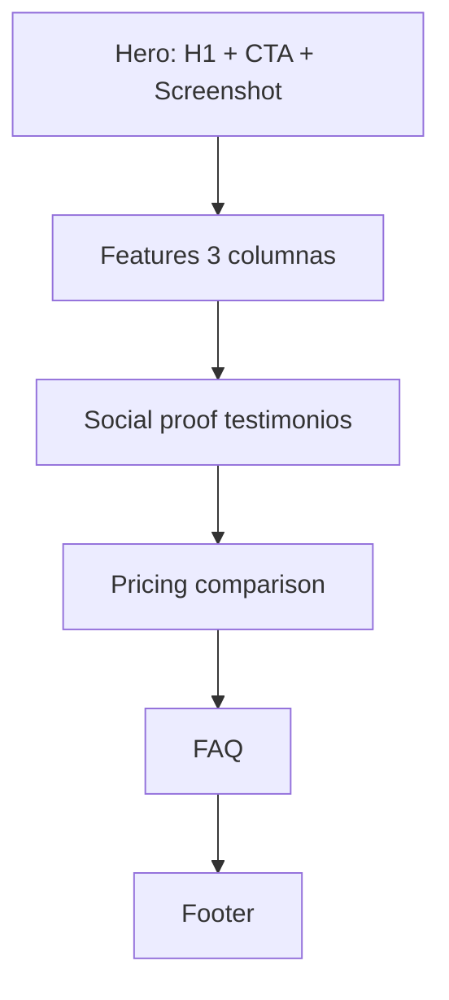

# Landing Page Spec Argus

## Wireframe

## Headlines (opciones)
- "Detección anti-cheat accionable para servidores serios."
- "Argus: menos ruido, más decisiones correctas."
- "ML + reglas de red para moderación de alto volumen."

## CRO y A/B tests
- Test A: CTA "Iniciar demo" vs B: "Probar gratis 14 días".
- Test A: pricing visible arriba vs B: pricing después de social proof.
- Test A: screenshot estático vs B: mini video loop.

## SEO
- Meta description: "Argus Anti-Cheat combina heurística y ML para detectar trampas con menos falsos positivos."
- OG tags: `og:title`, `og:description`, `og:image`, `og:url`.
- Structured data: `SoftwareApplication` + `FAQPage`.
