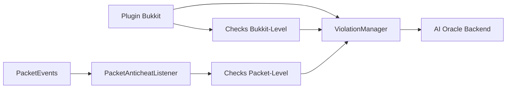

# Arquitectura del plugin Argus

## Flujo principal

## Explicacion tecnica

- El plugin Bukkit centraliza lifecycle, comandos y configuracion.
- `ViolationManager` consolida eventos de checks y define severidad acumulada.
- El backend AI Oracle recibe señales para enriquecer scoring y priorizacion.

## Soft-dependency fallback

Cuando PacketEvents no esta disponible:

1. Se desactiva pipeline de checks packet-level.
2. Se mantiene pipeline Bukkit-level para continuidad operativa.
3. Se emite warning de cobertura reducida.
4. El `ViolationManager` sigue funcionando con señales disponibles.

Esto permite no romper arranque del servidor y habilita adopcion progresiva.
