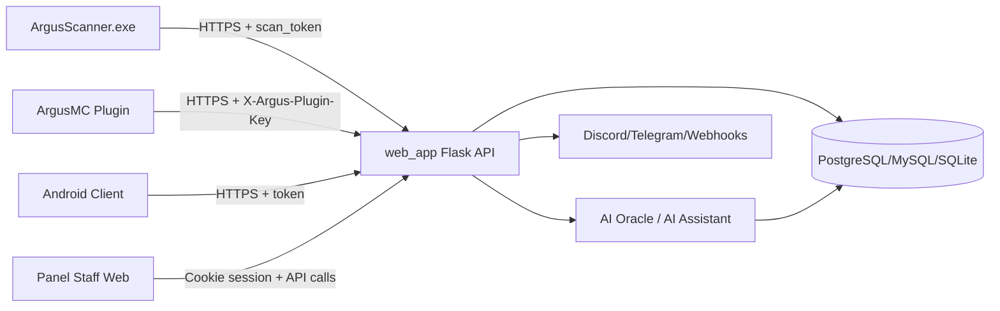

# Threat Model STRIDE — Argus Pack48 Round 2

## Data Flow (alto nivel)

## Activos y fronteras de confianza

- **Activos críticos:** cuentas staff/admin, `argus_pk_*`, scan tokens, historial de scans, verdicts, logs IA, datos PII (IP, UUID, usernames).
- **Trust boundaries:** cliente desktop/web/mobile/plugin -> internet -> API pública -> DB interna.
- **Supuestos actuales:** TLS en tránsito, pero sin pinning robusto cliente/plugin/mobile.

## STRIDE por componente

## 1) `web_app` (Flask API + panel)

| STRIDE | Amenaza | Vector | Impacto | Likelihood | Mitigación actual | Mitigación recomendada |
|---|---|---|---|---|---|---|
| S | Suplantación de admin | credenciales fallback/hardcode | toma de panel superadmin | Alto | login por sesión | fail-closed sin env + MFA |
| T | Mutación no autorizada | CSRF en endpoints state-changing | cambios de cuenta/tokens | Medio-Alto | SameSite=Lax | CSRF token + Origin check |
| R | Negación de acciones | logs incompletos por actor/contexto | forense débil | Medio | parte de staff_audit_log | trazabilidad obligatoria por endpoint |
| I | Divulgación info sensible | endpoints debug/db públicos | reconnaissance + fuga datos | Alto | algunas rutas auth-protected | cerrar debug en prod + red privada |
| D | DoS por costo | endpoints AI/scans sin límites homogéneos | degradación y costo cloud | Alto | rate-limit parcial | quota por actor/endpoint |
| E | Elevación privilegios | setup/admin paths legacy | control total del sistema | Alto | checks en varias rutas | eliminar rutas bootstrap + hardening authz |

## 2) ArgusScanner.exe

| STRIDE | Amenaza | Vector | Impacto | Likelihood | Mitigación actual | Mitigación recomendada |
|---|---|---|---|---|---|---|
| S | Suplantación backend | MITM con CA comprometida o proxy hostil | envío a servidor falso | Medio | TLS default requests | cert pinning opcional |
| T | Alteración config local | edición de `config.json` en AppData | token/api_url manipulados | Alto | validación funcional de token | firmar config o proteger secrets DPAPI |
| R | Repudio de envío | ausencia de firma por payload | disputa de origen de scan | Medio | timestamps | nonce + firma HMAC por scan |
| I | Fuga PII en logs | prints de token/IP/username | exposición local/soporte | Alto | logging operativo | redacción de secretos + log levels |
| D | Congelamiento scanner | payloads/respuestas grandes | bloqueo UX/timeout | Medio | timeouts básicos | límites duros de tamaño y retries acotados |
| E | EoP local por malware | robo token desde disco | abuso de API scans | Medio-Alto | token de uso limitado | rotación corta + binding token-dispositivo |

## 3) ArgusMC Plugin

| STRIDE | Amenaza | Vector | Impacto | Likelihood | Mitigación actual | Mitigación recomendada |
|---|---|---|---|---|---|---|
| S | spoof de staff/API | robo `argus_pk_*` en config | emisión fraudulenta de tokens SS | Alto | key prefix + server checks | mTLS/HMAC nonce+ts |
| T | tampering packets | replay/lag spoof/manipulación cliente | falsos negativos/positivos AC | Medio-Alto | múltiples checks packet | anti-replay server + score fusion |
| R | repudio de acciones staff | comandos sin firma fuerte de actor | disputas internas | Medio | logs de comandos | auditoría inmutable con trace-id |
| I | fuga de datos en chat/log | nombres/jugadores/razones visibles | privacy/reputación | Medio | permisos `argus.alerts` | minimización PII + masking |
| D | flood packets/events | spam packets para saturar checks | degradación TPS servidor | Medio | thresholds/check toggles | rate guard por jugador y circuit breaker |
| E | bypass permisos | subcomando sin permiso explícito futuro | abuso de acciones admin | Medio | gate `argus.admin` central | tests automáticos de permisos |

## 4) Android Client

| STRIDE | Amenaza | Vector | Impacto | Likelihood | Mitigación actual | Mitigación recomendada |
|---|---|---|---|---|---|---|
| S | backend spoof | sin pinning cert | scans a endpoint malicioso | Medio | HTTPS + cleartext off | pinning cert/public key |
| T | alteración APK/config | sideload APK troyanizado | telemetría adulterada | Medio | firma CI estable | publicar SHA256 y canal verificado |
| R | repudio de evidencias | payload sin firma cliente | dudas de integridad | Medio | timestamps | firma por dispositivo |
| I | sobrecolección de datos | permisos amplios (`QUERY_ALL_PACKAGES`, storage) | riesgo privacidad/compliance | Alto | allowBackup=false | DPIA + minimización + opt-in |
| D | abuso recursos | scans largos y FGS | batería/rendimiento | Medio | FGS y límites operativos | cuotas y pausas defensivas |
| E | debug/reverse | release sin minify/obfuscation | ingeniería inversa fácil | Medio | firma release | R8/obfuscación + hardening anti-tamper |

## 5) AI Oracle (servicios IA)

| STRIDE | Amenaza | Vector | Impacto | Likelihood | Mitigación actual | Mitigación recomendada |
|---|---|---|---|---|---|---|
| S | spoof respuestas IA | proveedor/API key comprometida | recomendaciones erróneas | Medio | fallback providers | validación de policy outputs |
| T | prompt injection | datos de usuario en prompts | salida manipulada/XSS downstream | Alto | algunos escapes frontend | sanitizar salida + safety layer |
| R | falta trazabilidad | decisión IA sin trazas completas | auditoría incompleta | Medio | ai_decisions_log parcial | log estructurado y versionado de prompt/modelo |
| I | exposición PII a terceros | prompts con datos sensibles | riesgo legal/compliance | Alto | no anonimización consistente | pseudonimizar y minimización |
| D | DoS por costo | abuso endpoints IA | costo elevado/latencia | Alto | límites parciales | rate-limits por actor + budget caps |
| E | EoP asistido por IA | IA sugiere acciones fuera de policy | abuso operativo | Medio | revisión humana en parte | policy engine de autorización |

## 6) Base de Datos

| STRIDE | Amenaza | Vector | Impacto | Likelihood | Mitigación actual | Mitigación recomendada |
|---|---|---|---|---|---|---|
| S | acceso indebido DB | credenciales/URL expuestas | compromiso total datos | Medio-Alto | secretos por env | rotación + secretos gestionados |
| T | corrupción de registros | endpoints admin/debug inseguros | integridad comprometida | Medio | auth en muchas rutas | RBAC estricto y least privilege |
| R | falta no-repudio | cambios sin actor completo | dificultad de investigación | Medio | parte de auditoría | auditoría inmutable |
| I | fuga de tablas/metadata | endpoints status/debug | reconnaissance y exfiltración | Alto | masking parcial env | bloquear metadata pública |
| D | locks/queries costosas | cargas masivas o scans flood | caída parcial servicio | Medio-Alto | índices parciales | límites, colas y timeouts DB |
| E | privilegio excesivo SQL | cuenta app con privilegios amplios | impacto total ante RCE | Medio | no evidenciado least-privilege | rol DB acotado por esquema |

## Riesgos prioritarios (round 2)

1. Exposición de secretos y endpoints sensibles (`Critical/High`).
2. Ausencia de controles anti-replay/pinning en plugin y clientes (`High`).
3. CSRF/rate-limit parcial en superficie web (`High`).
4. Riesgos de privacidad por PII en logs y telemetría (`High`).
5. Hardening incompleto en Android release (obfuscación/pinning) (`Medium/High`).
