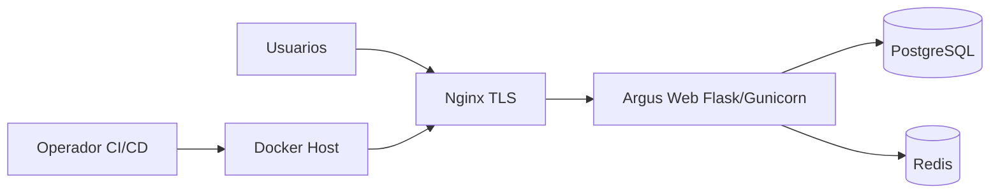

# Arquitectura self-hosted

```mermaid
flowchart LR
  U[Usuarios] --> N[Nginx TLS]
  N --> W[Argus Web Flask/Gunicorn]
  W --> P[(PostgreSQL)]
  W --> R[(Redis)]
  O[Operador CI/CD] --> D[Docker Host]
  D --> N
```
